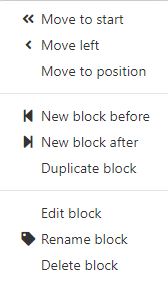

# New Tab Redux

New Tab Redux is a custom New Tab page replacement for Google Chrome and Mozilla Firefox (other browsers, especially Chromium-based ones, will probably work too).
It aims to provide a quick, customizable layout of links and menus, as well as simple bookmarks and history components.
There are a variety of optional extras as well, including:

* The ability to display notification counts from common websites
* The ability to display basket counts from common eCommerce websites
* Widgets such as a clock, stopwatch, notepad, weather forecast, access to Chrome Apps, and IP information
* Automatically renewing background images from Unsplash (with support for custom search terms or collections)

## Installation

New Tab Redux is built as a browser extension that replaces the New Tab page.
The following steps will install the extension and automatically apply it as your New Tab page.

### Chrome

1. Clone the repository to your computer, or [download it as a ZIP](https://github.com/Kallb123/NewTabRedux/archive/master.zip) then extract it somewhere it can stay permanently
2. Open the Chrome `Extension` settings by navigating the menus or visiting [chrome://extensions/](chrome://extensions/)
3. Enable the `Developer mode` toggle in the top right
4. Select the `Load unpacked` button in the top left
5. Browse to the `New Tab Redux` folder that you downloaded in step 1 so that you can see the `lib` and `res` folders, then press OK to accept this folder.

You may or may not want the extension to work in Incognito mode, this can be toggled by going into the extension Details page.

### Firefox

1. Download the latest xpi file from the [Releases page](https://github.com/Kallb123/NewTabRedux/releases)
2. Open the Firefox `Addons` page by using the menu in the top right or by visiting [about:addons](about:addons)
3. Click the settings icon in the top right and select `Install Add-on From File...`
4. Navigate to the xpi file you downloaded in step 1 and select it
5. Accept any prompt to install the add-on.

## Usage

On first "boot", you will be provided with a default dashboard, but this can be overriden easily.
If you select `Customize` from the top right `Settings` menu, then you can paste in a JSON source to override the dashboard.
Alternatively, by hovering over the title of a block of links, you can click the dropdown to get the following menu:



This menu allows you to easily move blocks of links around without messing with JSON.
The `Edit block` option opens a popup which allows you to edit the individual links and menus within each block (as well as adding more).

### Import

Whilst you can completely customise the setup manually, it is also possible to import a previous configuration from a backup or from somebody else.
You can access this from the top right settings menu.
Importing will override all settings, such as links and overall style.
You can export a file to keep as a backup, this is important since all settings are stored within the browser and won't automatically transfer to a new browser or computer.

## Dependencies

* [Bootstrap](https://getbootstrap.com)
* [Font Awesome](https://fontawesome.io)
* [jQuery](https://jquery.com)
* [HTML5 Sortable](https://farhadi.ir/projects/html5sortable/)
* [Mousetrap](https://craig.is/killing/mice)

## Keyboard shortcuts

If enabled, the page can be navigated by keyboard.
Note that Chrome will, by default, give focus to the onmibox when opening a new tab, so you must first `Tab` into the page.

> Note: shortcuts are disabled whilst input fields (text boxes, selects, buttons) are currently focused.

### Global

* `Q` `L` - switch to links
* `W` `B` - switch to bookmarks
* `E` `A` - open apps dropdown
* `R` `H` - open history dropdown
* `T` `K` - open baskets dropdown
* `Y` `N` - open notifcations dropdown
* `U` `S` - open settings dropdown (`Shift` for modal)
* `Tab` `Shift+Tab` - scroll through dropdown options

### Apps

* `Shift+A` - open Chrome Apps page
* `Shift+Alt+A` - go to Chrome Web Store

### Links

* `1` ... `0` - select nth block (`0` for 10th)
* `-` `=` - select previous/next block
* `[` `]` - select previous/next button in block
* `Enter` - open link
* `Backspace` - clear selection

### Bookmarks

* `/` - focus search field

### Baskets

* `Shift+K` - refresh baskets
* `Shift+Alt+K` - open all non-empty basket pages

### Notifications

* `Shift+N` - refresh notifications
* `Shift+Alt+N` - open all unread notification pages

### Settings

* `Tab` `Shift+Tab` - cycle tabs
* `Enter` - switch to fields in tab
* `Ctrl+Enter` - save and reload
* `Esc` - cancel

### Misc

* `?` - show keyboard shortcuts modal

## Links format

Links can be edited in JSON from the Settings modal.  The basic format is as follows:

### Block

A block has a title, and holds one or more buttons.

```json
{
    "title": "Search Engines",
    "buttons": [...]
}
```

### Button

A button can either be a simple link, or a dropdown containing many links.  Add `"external": true` to always open a link in a new tab.

```json
{
    "title": "Google",
    "url": "https://www.google.co.uk",
    "external": true,
    "style": "light"
}
```

```json
{
    "title": "Google",
    "menu": [...],
    "style": "dark"
}
```

The styles are that of Bootstrap (`default`, `primary`, `info`, `success`, `warning` and `danger`), plus `light` and `dark` for shades of grey.

### Menu

A menu is a list of links and headings, converted into groups of links (a new group starts at each heading).  To start a group without a heading, use the empty string `""` as the label.

```json
[
    {
        "title": "Worldwide",
        "url": "https://www.google.com"
    },
    {
        "title": "UK",
        "url": "https://www.google.co.uk"
    },
    "Tools",
    {
        "title": "Images",
        "url": "https://images.google.co.uk"
    },
    {
        "title": "Maps",
        "url": "https://maps.google.co.uk",
        "external": true
    }
]
```

With the above steps, you should end up with a block and dropdown like this:


## Notifications

Enabling a notification option will prompt for the relevant permission in order to access the given website (and the corresponding block will be highlighted with green text).  Disabling it will not immediately remove this, but any unnecessary permissions will be dropped when settings are saved.

In order to read arbitrary websites, the global permissions `https://*/` and/or `https://*/` must be granted.  If not (i.e. adding a permission just for a given site), it will be lost if the browser is restarted, unless explicitly declared in `optional_permissions` in the manifest (see [Chrome issue #158004](https://code.google.com/p/chromium/issues/detail?id=158004)).

> Note: if an option is later re-enabled, Chrome may not re-request the permission, however all currently granted permissions can be seen from Chrome's extension settings page (chrome://extensions).

### Gmail

The Gmail notifier can be configured for multiple accounts by specifying the user indexes (as can be found in a Google URL with `?authuser=X` or `/u/X/`).  If a user is not signed in, or does not have a Gmail account, an Authentication Required dialog will display from attempting to access the feed unauthorized.

## Incognito mode

If New Tab Redux is allowed to run in incognito mode, it will also display as the New Tab page of incognito windows.  It shares settings with normal windows, however history and notifications are disabled.
